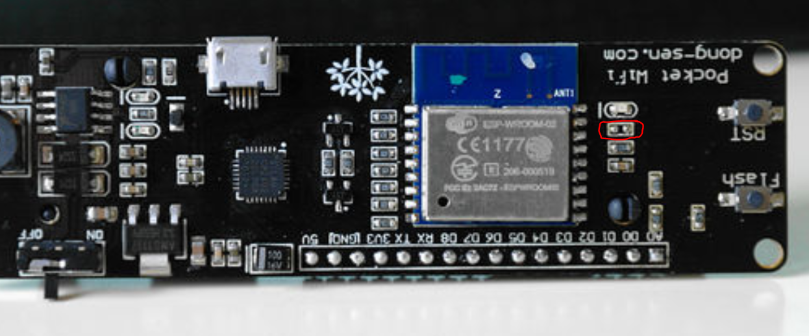

# Remote temperature sensor.

## Board type:
`WEMOS ESP-WROOM-02`

# Deep sleep:
https://www.esp8266.com/viewtopic.php?p=84925

https://mischianti.org/2019/11/21/wemos-d1-mini-esp8266-the-three-type-of-sleep-mode-to-manage-energy-savings-part-4/

On these boards you need to connect these pads in order for deep sleep to work:

When these pads are connected you can not upload to the board! You should connect these using a switch.

# `*.noload`
Add any file extension to the end of your cpp file to prevent it from being compiled!