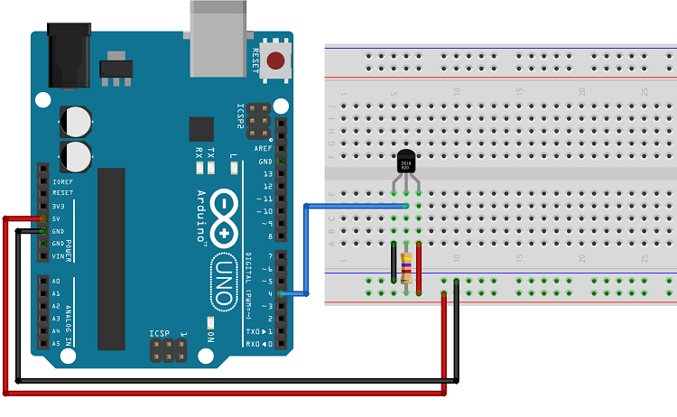

# Remote temperature sensor.

## Board type:
`WEMOS ESP-WROOM-02`

# `*.noload`
Add any file extension to the end of your cpp file to prevent it from being compiled!

# Deep sleep:
https://www.esp8266.com/viewtopic.php?p=84925

https://mischianti.org/2019/11/21/wemos-d1-mini-esp8266-the-three-type-of-sleep-mode-to-manage-energy-savings-part-4/

On these boards you need to connect these pads in order for deep sleep to work:

When these pads are connected you can not upload to the board! You should connect these using a switch.

# Temperature sensor configuration:

Connect 5V, and GND. 4.7k resistor between data and 5v. Data to D4. See image for config with the Arduino uno.

while we're using the waterproof variant of the DS18B20, for this purpose it's the same sensor.

